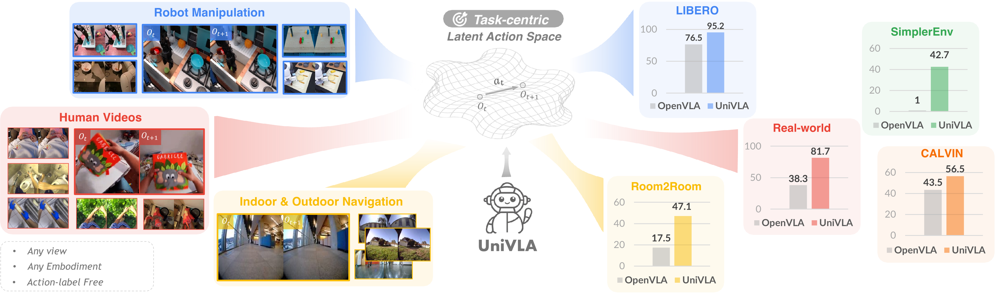

# :earth_asia: UniVLA


<div id="top" align="center">
<p align="center">

</p>
</div>

> #### :page_facing_up: [Paper](https://arxiv.org/pdf/2505.06111) | :rocket: Demo Page (Coming Soon)
> :black_nib: Qingwen Bu, Y. Yang, J. Cai, S. Gao, G. Ren, M. Yao, P. Luo, H. Li \
> :e-mail: Primary Contact: Qingwen Bu (buqingwen@opendrivelab.com)

### :fire: Highlights
- A recipe towards generalist policy by planning in a unified, embodiment-agnostic action space.
- A novel approach for extracting task-centric latent actions from cross-embodiment videos.
- A VLA that achieves state-of-the-art results on multiple benchmarks with compute-efficient training.

## Table of Contents
- [:movie_camera: Demo](#movie_camera-demo)
- [:loudspeaker: News](#loudspeaker-news)
- [:pushpin: TODO List](#pushpin-todo-list)
- [🤗 Model Zoo](#ckpts)
- [:video_game: Getting Started](#installation)
- [:fire: Training Recipe](#fire-training-recipe)
  - [Task-centric Latent Action Learning](#one-task-centric-latent-action-learning)
  - [Pretraining of Generalist Policy](#two-pretraining-of-generalist-policy)
  - [Post-training for Deployment & Evaluations](#three-post-training-for-deployment--evaluations)
    - [Real-world Experiment](#mechanical_arm-real-world-experiment)
    - [LIBERO](#1-libero)
    - [CALVIN](#2-calvin)
- [:rocket: UniVLA's Performance](#rocket-univlas-performance)
- [:pencil: Citation](#pencil-citation)


  
## :movie_camera: Demo
Real-world robot experiments.


<table style="width:100%;border-collapse:collapse;">
<tr>
  <td style="text-align:center;"><b>Store the screwdriver (1x speed)</b></td>
  <td style="text-align:center;"><b>Clean the cutting board (1x speed)</b></td>
  <td style="text-align:center;"><b>Fold towel twice (1x speed)</b></td>
</tr>
<tr>
  <td><video src="https://github.com/user-attachments/assets/b11b4e83-24d8-4b55-b50e-f8271249422c" style="object-fit:cover;" autoplay loop muted></video></td>
  <td><video src="https://github.com/user-attachments/assets/bafb5bac-8c8e-41d4-89d0-ec774b9b6e1c" style="object-fit:cover;" autoplay loop muted></video></td>
  <td><video src="https://github.com/user-attachments/assets/6779e0e4-aa6e-4c16-adb9-30dedfd4db85" style="object-fit:cover;" autoplay loop muted></video></td>
</tr>
<tr>

  <td style="text-align:center;"><b>Stack the tower of hanoi (1x speed)</b></td>
</tr>
<tr>
  <td><video src="https://github.com/user-attachments/assets/61f663da-18df-4892-ae8f-5e03aac7469e" style="object-fit:cover;" autoplay loop muted></video></td>
  <td><video src="https://github.com/user-attachments/assets/da7d7d4e-0634-42d7-8e88-8bb269965b1a" style="object-fit:cover;" autoplay loop muted></video></td>
  <td><video src="https://github.com/user-attachments/assets/cb3afa9a-ffeb-4879-b915-1803d7ff8262" style="object-fit:cover;" autoplay loop muted></video></td>
</tr>
</table>


## :loudspeaker: News

- **[2025/05]** The code of UniVLA v1.0 is released. Please check it out!


## :pushpin: TODO list


#### 1. 🤗 Checkpoints Release
  -  [x] 1) Latent action model
  -  [x] 2) Pre-trained Models
      - [x] *Full (Manip. + Navi. + Human)*
      - [x] *BridgeV2-Only*
      - [x] *Human-Only*
  -  [x] 3) Downstream Fine-tuned Models
      - [x] *LIBERO*
      - [ ] *Room2Room*
      - [ ] *CALVIN*
      - [ ] *SimplerEnv*
#### 2. 💪 Training and Evlauation Codes on Simulation Benchmarks
  -  [x] **1) LIBERO**
  -  [ ] **2) Room2Room**
  -  [x] **3) CALVIN**
  -  [ ] **4) SimplerEnv**
#### 3. :dizzy: Codes and Guidelines for Real-world Deployment
  -  [x] Codes and Docs
#### 4. :information_desk_person: Scripts for Pre-processing Human Dataset
  -  [ ] Codes for converting Ego4D into RLDS format


## 🤗 Model Zoo <a name="ckpts"></a>

<table>
  <tr>
    <th>Model Name</th>
    <th>Backbone</th>
    <th>HF Path</th>
    <th>Note</th>
  </tr>
  <tr>
    <td>lam-stage-1</td>
    <td> - </td>
    <td><a href="https://huggingface.co/qwbu/univla-latent-action-model">univla-latent-action-model</a></td>
    <td> The stage-1 latent action model trained on OpenX and Ego4D. </td></td>
  </tr>
    <tr>
    <td>lam-stage-2</td>
    <td> - </td>
    <td><a href="https://huggingface.co/qwbu/univla-latent-action-model">univla-latent-action-model</a></td>
    <td> The stage-2 latent action model trained on OpenX and Ego4D. (Generate task-centric latent actions.)</td>
  </tr>
  <tr>
    <td>univla-7b</td>
    <td><a href="https://huggingface.co/TRI-ML/prismatic-vlms/tree/main/prism-dinosiglip-224px%2B7b">TRI-ML/prismatic-vlms/prism-dinosiglip-224px+7b</a></td>
    <td><a href="https://huggingface.co/qwbu/univla-7b">univla-7b</a></td>
    <td>UniVLA pretrained on our full data collection (Manip. + Navi. + Human). </td>
  </tr>
  <tr>
    <td>univla-7b-bridge-pt</td>
    <td><a href="https://huggingface.co/TRI-ML/prismatic-vlms/tree/main/prism-dinosiglip-224px%2B7b">TRI-ML/prismatic-vlms/prism-dinosiglip-224px+7b</a></td>
    <td><a href="https://huggingface.co/qwbu/univla-7b-bridge-pt">univla-7b-bridge-pt</a></td>
    <td>UniVLA pretrained only on BridgeV2 data.</a></td>
  </tr>
  <tr>
    <td>univla-7b-human-pt</td>
    <td><a href="https://huggingface.co/TRI-ML/prismatic-vlms/tree/main/prism-dinosiglip-224px%2B7b">TRI-ML/prismatic-vlms/prism-dinosiglip-224px+7b</a></td>
    <td><a href="https://huggingface.co/qwbu/univla-7b-human-pt">univla-7b-human-pt</a></td>
    <td>UniVLA pretrained only on Ego4D human videos. </a></td>
  </tr>
  <tr>
    <td>univla-7b-224-sft-libero</td>
    <td><a href="https://huggingface.co/qwbu/univla-7b">univla-7b</a></td>
    <td><a href="https://huggingface.co/qwbu/univla-7b-224-sft-libero">univla-7b-224-sft-libero</a></td>
    <td>Finetuned on the LIBERO dataset</a></td>
  </tr>
</table>


## :video_game: Getting Started <a name="installation"></a>

1. (Optional) We use conda to manage the environment.

```bash
conda create -n univla python=3.10 -y
conda activate univla
```

2. Install dependencies.

```bash
# Install pytorch
# Look up https://pytorch.org/get-started/previous-versions/ with your cuda version for a correct command
# Our experiments are conducted with 'torch 2.2.0 + cuda 12.1'
pip install torch torchvision

# Clone our repo and pip install to download dependencies
git clone git@github.com:OpenDriveLab/UniVLA.git
cd univla
pip install -e .

# Install Flash Attention 2 for training (https://github.com/Dao-AILab/flash-attention)
pip install packaging ninja
ninja --version; echo $?  # Verify Ninja --> should return exit code "0"
pip install "flash-attn==2.5.5" --no-build-isolation
```

## :fire: Training Recipe

### :one: Task-centric Latent Action Learning
> We hightly recommond directly using our pre-trained latent action model ckeckpoints to save your time and compute.

> [!NOTE]
> Our latent action model is trained on a comprehensive data collection, encompassing multiple robotic manipulation and navigation datasets from Open X-Embodiment, along with a curated subset of the Ego4D dataset (detailed data construction procedures are provided in the appendix of our [paper](https://www.roboticsproceedings.org/rss21/p014.pdf)).
>
> To adapt the model to additional datasets or custom data sources, users may refer to ```./prismatic/vla/datasets/rlds/oxe/mixtures.py``` to either utilize predefined data mixtures or define new ones. Subsequently, the ```data_mix``` parameter in the [configuration file](https://github.com/OpenDriveLab/UniVLA/blob/aab94fdf98221a19c0c9a114c921f069ed449265/latent_action_model/config/lam-stage-1.yaml#L27) should be updated accordingly.


The latent action model is implemented based on [VQ-VAE](https://arxiv.org/abs/1711.00937).
We train the latent action model on the collection of dataset comprising robot manipulation, navigation and human videos. In stage-1 training, we use an overall batch size of 512 and 100k optimization steps to construct the task-irrelevant latent actions:

```bash
torchrun --standalone --nnodes 1 --nproc-per-node 8 main.py fit \
    --config config/lam-stage-1.yaml \
    2>&1 | tee lam-stage-1.log
```

The following stage-2 then focuses on learning task-centric latent actions on the basis of stage-1 results. Please modify the ```stage_one_ckpt``` in ```latent_action_model/config/lam-stage-2.yaml``` to your local path of stage-1 checkpoint, then run training with:

```bash
torchrun --standalone --nnodes 1 --nproc-per-node 8 main.py fit \
    --config config/lam-stage-2.yaml \
    2>&1 | tee lam-stage-2.log
```


### :two: Pretraining of Generalist Policy

- **Latent Action Pseudo-Labeling for Policy Optimization:** The trained latent action model is employed to generate pseudo-labels for policy optimization via a next-token prediction objective. Specifically, the indices of inferred latent actions in the VQ-VAE codebook are mapped to dedicated tokens in the LLaMA tokenizer, denoted as ```{ACT_0, ACT_1, ..., ACT_C}```.

- **Cost-effective Pre-Training:** The full-scale pre-training procedure, incorporating both OpenX and Ego4D datasets, was performed using a 32-GPU A100 cluster over 20,000 optimization steps. This training regimen required approximately 960 A100 GPU-hours, representing just 5% of the computational resources utilized by OpenVLA. Furthermore, experiments conducted on the 'Bridge' and 'Human' subsets demanded only 200 GPU-hours, demonstrating substantially reduced computational requirements compared to previous vision-language-action models.


- To initiate pre-training, please refer to the following scipt or simply run ```bash ./vla-scripts/train.sh```:

> [!NOTE]
> For pretraining UniVLA only on BridgeV2 or Human (Ego4D) data, please modify ```vla.type``` to ```prism-dinosiglip-224px+mx-bridge(human)``` correspondingly. Detailed setups can be found in ```./prismatic/conf/vla.py```.

```bash
### Experiment on a 32-GPU cluster
GPUS_PER_NODE=8  
NNODES=4
MASTER_PORT=${MASTER_PORT:-28596}
MASTER_ADDR=${MASTER_ADDR:-"127.0.0.1"}
RANK=${RANK:-0}

# Run your training script with torchrun
torchrun --nproc_per_node ${GPUS_PER_NODE} --nnodes ${NNODES} --node_rank ${RANK} --master_addr ${MASTER_ADDR} --master_port ${MASTER_PORT} train.py \
                                 --vla.type prism-dinosiglip-224px+mx-oxe-magic-soup-plus \
                                 --run_root_dir "vla_log" \
```
                                 
Once pretraining is complete, convert the UniVLA weights (default 'Prismatic' format) to HuggingFace AutoClasses with:

```
python vla-scripts/extern/convert_openvla_weights_to_hf.py \
    --openvla_model_path_or_id /path/to/your/pretrained_ckpt_path \
    --ckpt_name /path/to/your/specific_ckpt_name.pt \
    --output_hf_model_local_path /path/to/your/output_model_path
```

The converted model is then compatible with HF AutoClasses 'AutoModelForVision2Seq'.

### :three: Post-training for Deployment & Evaluations

- With the pretrained generalist policy trained to plan over an embodiment-agnostic action space, we then add embodiment-specific action decoder heads for downstream deployment.
- Our action decoder is extremely lightwight with only around 12M parameters. Using parameter efficient fine-tuning with LoRA rank 32, the total trainable parameter is around 123M.

#### :mechanical_arm: Real-world Experiment

> Our guidelines are based on real-device testing conducted on the AgiLex platform. If you have code deployed on other platforms or in different data formats, we welcome pull requests!

We provide a simple [guideline](https://github.com/OpenDriveLab/UniVLA/blob/3daa7e9a8f4ca92fdee960f8d6be73508344e81d/docs/real-world-deployment.md) to deploy UniVLA on your customized setups.

#### 1) LIBERO
> Please first download the [LIBERO datasets](https://huggingface.co/datasets/openvla/modified_libero_rlds/tree/main) that we used in experiments

Start training with ```torchrun```:
1) You should first set the pretrained UniVLA and latent action model path in ```vla_path``` and ```lam_path``` of the [training config](https://github.com/OpenDriveLab/UniVLA/blob/b502b3eddc05fef9984d34932a41c96e5a9f21a3/vla-scripts/finetune_libero.py#L107).
2) Set your local LIBERO dataset path in [```data_root_dir```](https://github.com/OpenDriveLab/UniVLA/blob/b502b3eddc05fef9984d34932a41c96e5a9f21a3/vla-scripts/finetune_libero.py#L110).
3) You can choose ```dataset_name``` from ```libero_spatial_no_noops```, ```libero_object_no_noops```, ```libero_goal_no_noops```, and ```libero_10_no_noops```
> We trained on *'Spatial'*, *'Object'* and *'Goal'* for 30k steps and *'Long'* for 40k steps. Please first modify the ```max_steps``` in training config accordingly for reproduction.

```bash
# Start training on LIBERO-10(long) with 8 GPUs
torchrun --standalone --nnodes 1 --nproc-per-node 8 finetune_libero.py \
                                 --dataset_name "libero_10_no_noops" \
                                 --run_root_dir "libero_log" \
```

Once you finished training and get the action decoder and UniVLA backbone, you can start evaluation with:


```bash
# Start evaluation on LIBERO-10
# [Optional] Install LIBERO dependencies
pip install -r experiments/robot/libero/libero_requirements.txt

# By default, we test for 50 rollouts every task, totalling 500 independent trials.
python experiments/robot/libero/run_libero_eval.py \
    --task_suite_name libero_10 \   # Choose from [libero_spatial, libero_object, libero_goal, libero_10] 
    --action_decoder_path /path/to/your/action_decoder_path.pt \
    --pretrained_checkpoint /path/to/your/libero_10_finetuned_univla \
    --save_video False    # Whether to save rollout videos \
    --num_trials_per_task 50 \
    --seed 7
```

#### 2) CALVIN

> Please first follow [CALVIN](https://github.com/mees/calvin) to install relavent dependencies and prepare your dataset

1) You should first set the pretrained UniVLA and latent action model path in ```vla_path``` and ```lam_path``` of the training config.
2) Set your local CALVIN directory path in ```calvin_root```.
3) Start training with ```torchrun```:

```bash
torchrun --standalone --nnodes 1 --nproc-per-node 8 finetune_calvin.py \
                                 --vla_path /path/to/your/univla-7b \
                                 --lam_path /path/to/your/lam-stage-2.ckpt \
                                 --calvin_root /path/to/yout/calvin_root_path \
                                 --max_steps 100000 \
                                 --batch_size 8 \
                                 --grad_accumulation_steps 2 \
                                 --window_size 12 \ 
                                 --run_root_dir "calvin_log" 
```

Start evaluation on CALVIN:

```bash
# Mutli-GPU evaluation is supported
torchrun --standalone --nnodes 1 --nproc-per-node 8 experiments/robot/calvin/run_calvin_eval_ddp.py \
    --calvin_root /path/to/yout/calvin_root_path \
    --action_decoder_path /path/to/your/action_decoder_path.pt \
    --pretrained_checkpoint /path/to/your/calvin_finetuned_univla \
    --seed 7
```
> To be updated.

## :rocket: UniVLA's Performance

> [!NOTE]
> LIBERO Simulation Benchmark Results.

<table style="width:100%; border:1px solid; border-collapse:collapse;">
  <thead>
    <tr style="text-align: center; border:1px solid;">
      <th rowspan="2" style="border:1px solid;">Model</th>
      <th colspan="2" style="border:1px solid;">LIBERO-Spatial</th>
      <th colspan="2" style="border:1px solid;">LIBERO-Object</th>
      <th colspan="2" style="border:1px solid;">LIBERO-Goal</th>
      <th colspan="2" style="border:1px solid;">LIBERO-Long</th>
      <th colspan="2" style="border:1px solid;">Average</th>
    </tr>
    <tr style="text-align: center; border:1px solid;">
      <th style="border:1px solid;">SR (↑)</th>
      <th style="border:1px solid;">Rank (↓)</th>
      <th style="border:1px solid;">SR (↑)</th>
      <th style="border:1px solid;">Rank (↓)</th>
      <th style="border:1px solid;">SR (↑)</th>
      <th style="border:1px solid;">Rank (↓)</th>
      <th style="border:1px solid;">SR (↑)</th>
      <th style="border:1px solid;">Rank (↓)</th>
      <th style="border:1px solid;">SR (↑)</th>
      <th style="border:1px solid;">Rank (↓)</th>
    </tr>
  </thead>
  <tbody>
    <tr style="border:1px solid;">
      <td style="border:1px solid;">Diffusion Policy</td>
      <td style="border:1px solid; text-align:center;"> 78.3 ± 1.1%</td>
      <td style="border:1px solid; text-align:center;"> 5</td>
      <td style="border:1px solid; text-align:center;">92.5 ± 0.7%</td>
      <td style="border:1px solid; text-align:center;">2</td>
      <td style="border:1px solid; text-align:center;">68.3 ± 1.2%</td>
      <td style="border:1px solid; text-align:center;">5</td>
      <td style="border:1px solid; text-align:center;">50.5 ± 1.3%</td>
      <td style="border:1px solid; text-align:center;">5</td>
      <td style="border:1px solid; text-align:center;">72.4 ± 0.7%</td>
      <td style="border:1px solid; text-align:center;">5</td>
    </tr>
    <tr style="border:1px solid;">
      <td style="border:1px solid;">Octo</td>
      <td style="border:1px solid; text-align:center;">78.9 ± 1.0%</td>
      <td style="border:1px solid; text-align:center;">4</td>
      <td style="border:1px solid; text-align:center;">85.7 ± 0.9%</td>
      <td style="border:1px solid; text-align:center;">4</td>
      <td style="border:1px solid; text-align:center;">84.6 ± 0.9%</td>
      <td style="border:1px solid; text-align:center;">2</td>
      <td style="border:1px solid; text-align:center;">51.1 ± 1.3%</td>
      <td style="border:1px solid; text-align:center;">4</td>
      <td style="border:1px solid; text-align:center;">75.1 ± 0.6%</td>
      <td style="border:1px solid; text-align:center;">3</td>
    </tr>
    <tr style="border:1px solid;">
      <td style="border:1px solid;">OpenVLA</td>
      <td style="border:1px solid; text-align:center;">84.7 ± 0.9%</td>
      <td style="border:1px solid; text-align:center;">2</td>
      <td style="border:1px solid; text-align:center;">88.4 ± 0.8%</td>
      <td style="border:1px solid; text-align:center;">3</td>
      <td style="border:1px solid; text-align:center;">79.2 ± 1.0%</td>
      <td style="border:1px solid; text-align:center;">3</td>
      <td style="border:1px solid; text-align:center;">53.7 ± 1.3%</td>
      <td style="border:1px solid; text-align:center;">3</td>
      <td style="border:1px solid; text-align:center;">76.5 ± 0.6%</td>
      <td style="border:1px solid; text-align:center;">2</td>
    </tr>
    <tr style="border:1px solid;">
      <td style="border:1px solid;">TraceVLA</td>
      <td style="border:1px solid; text-align:center;">84.6 ± 0.2%</td>
      <td style="border:1px solid; text-align:center;">3</td>
      <td style="border:1px solid; text-align:center;">85.2 ± 0.4%</td>
      <td style="border:1px solid; text-align:center;">5</td>
      <td style="border:1px solid; text-align:center;">75.1 ± 0.3%</td>
      <td style="border:1px solid; text-align:center;">4</td>
      <td style="border:1px solid; text-align:center;">54.1 ± 1.0%</td>
      <td style="border:1px solid; text-align:center;">2</td>
      <td style="border:1px solid; text-align:center;">74.8 ± 0.5%</td>
      <td style="border:1px solid; text-align:center;">4</td>
    </tr>
    <tr style="border:1px solid;">
      <td style="border:1px solid;">UniVLA (Ours)</td>
      <td style="border:1px solid; text-align:center;"><b>96.5 ± 0.5%</b></td>
      <td style="border:1px solid; text-align:center;">1</td>
      <td style="border:1px solid; text-align:center;"><b>96.8 ± 0.5%</b></td>
      <td style="border:1px solid; text-align:center;">1</td>
      <td style="border:1px solid; text-align:center;"><b>95.6 ± 0.4%</b></td>
      <td style="border:1px solid; text-align:center;">1</td>
      <td style="border:1px solid; text-align:center;"><b>92.0 ± 1.0%</b></td>
      <td style="border:1px solid; text-align:center;">1</td>
      <td style="border:1px solid; text-align:center;"><b>95.2 ± 0.3%</b></td>
      <td style="border:1px solid; text-align:center;">1</td>
    </tr>
  </tbody>
</table>


> [!NOTE]
> LIBERO Results with Limited Data. (Models are trained with 10%, 20%, 50%, and the full dataset)

<table style="width:100%; border:1px solid; border-collapse:collapse;">
  <thead>
    <tr style="text-align: center; border:1px solid;">
      <th rowspan="2" style="border:1px solid;">Model</th>
      <th colspan="4" style="border:1px solid;">LIBERO-Goal</th>
      <th colspan="4" style="border:1px solid;">LIBERO-Long</th>
    </tr>
    <tr style="text-align: center; border:1px solid;">
      <th style="border:1px solid;">10%</th>
      <th style="border:1px solid;">20%</th>
      <th style="border:1px solid;">50%</th>
      <th style="border:1px solid;">100%</th>
      <th style="border:1px solid;">10%</th>
      <th style="border:1px solid;">20%</th>
      <th style="border:1px solid;">50%</th>
      <th style="border:1px solid;">100%</th>
    </tr>
  </thead>
  <tbody>
    <tr style="border:1px solid;">
      <td style="border:1px solid;">ATM</td>
      <td style="border:1px solid; text-align:center;">64.3%</td>
      <td style="border:1px solid; text-align:center;">77.1%</td>
      <td style="border:1px solid; text-align:center;">-</td>
      <td style="border:1px solid; text-align:center;">-</td>
      <td style="border:1px solid; text-align:center;">36.5%</td>
      <td style="border:1px solid; text-align:center;">39.1%</td>
      <td style="border:1px solid; text-align:center;">-</td>
      <td style="border:1px solid; text-align:center;">-</td>
    </tr>
    <tr style="border:1px solid;">
      <td style="border:1px solid;">OpenVLA</td>
      <td style="border:1px solid; text-align:center;">61.4%</td>
      <td style="border:1px solid; text-align:center;">66.0%</td>
      <td style="border:1px solid; text-align:center;">77.0%</td>
      <td style="border:1px solid; text-align:center;">79.2%</td>
      <td style="border:1px solid; text-align:center;">11.6%</td>
      <td style="border:1px solid; text-align:center;">22.4%</td>
      <td style="border:1px solid; text-align:center;">36.6%</td>
      <td style="border:1px solid; text-align:center;">53.7%</td>
    </tr>
    <tr style="border:1px solid;">
      <td style="border:1px solid;">OpenVLA-OFT</td>
      <td style="border:1px solid; text-align:center;">76.8%</td>
      <td style="border:1px solid; text-align:center;">88.2%</td>
      <td style="border:1px solid; text-align:center;">91.1%</td>
      <td style="border:1px solid; text-align:center;"><b>96.2%</b></td>
      <td style="border:1px solid; text-align:center;">43.0%</td>
      <td style="border:1px solid; text-align:center;">62.2%</td>
      <td style="border:1px solid; text-align:center;">77.8%</td>
      <td style="border:1px solid; text-align:center;">90.7%</td>
    </tr>
    <tr style="border:1px solid;">
      <td style="border:1px solid;">UniVLA (Ours)</td>
      <td style="border:1px solid; text-align:center;"><b>86.3%</b></td>
      <td style="border:1px solid; text-align:center;"><b>90.4%</b></td>
      <td style="border:1px solid; text-align:center;"><b>93.1%</b></td>
      <td style="border:1px solid; text-align:center;">95.6%</td>
      <td style="border:1px solid; text-align:center;"><b>62.4%</b></td>
      <td style="border:1px solid; text-align:center;"><b>71.4%</b></td>
      <td style="border:1px solid; text-align:center;"><b>87.0%</b></td>
      <td style="border:1px solid; text-align:center;"><b>92.0%</b></td>
    </tr>
  </tbody>
</table>

> [!NOTE]
> Real-world Experiments.
<div id="top" align="center">
<p align="center">

</p>
</div>

## :pencil: Citation
If you find our code or models useful in your work, please cite [our paper](https://arxiv.org/pdf/2505.06111):

```bibtex
@article{bu2025univla,
  title={UniVLA: Learning to Act Anywhere with Task-centric Latent Actions}, 
  author={Qingwen Bu and Yanting Yang and Jisong Cai and Shenyuan Gao and Guanghui Ren and Maoqing Yao and Ping Luo and Hongyang Li},
  journal={arXiv preprint arXiv:2505.06111},
  year={2025}
}
```

## Acknowledgements

We thank [OpenVLA](https://github.com/openvla/openvla) for their open-sourced work!


